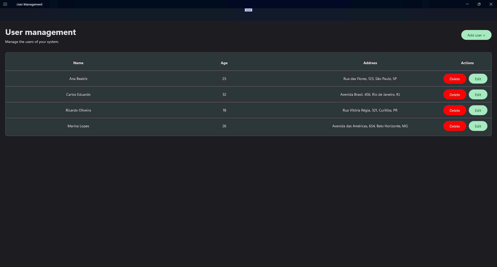
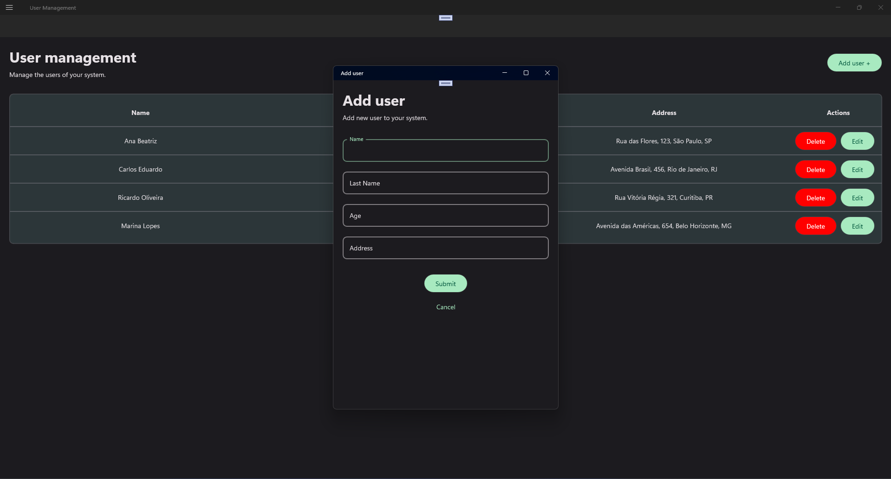
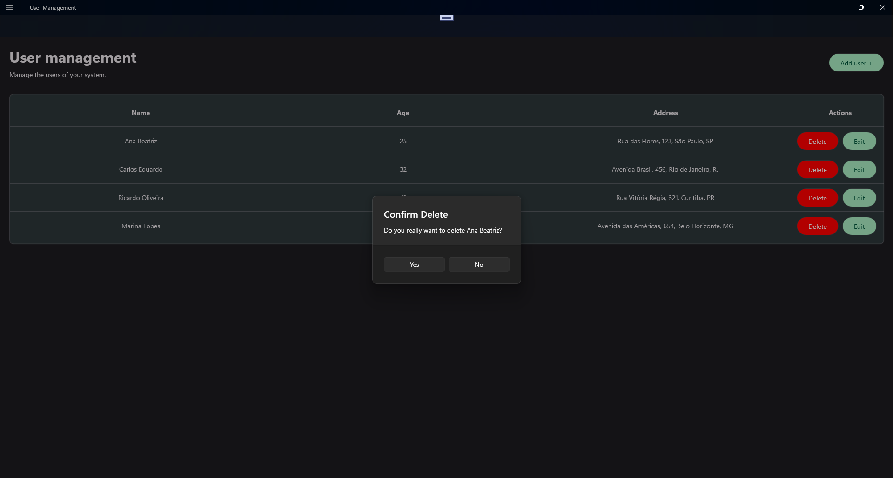
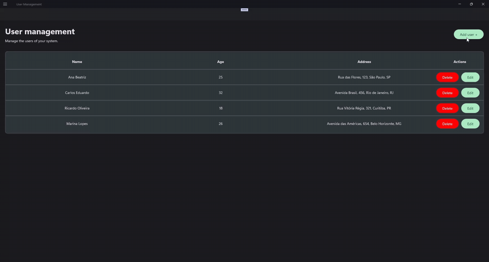

# UserManagement - Gerenciamento de Usuários

Projeto desenvolvido para gerenciamento de usuários, com funcionalidades de criar, listar, editar e deletar.

## Tecnologias Utilizadas

- **.NET MAUI 9** (Windows)
    
- **SQLite** para persistência de dados
    
- **Xunit** para testes unitários
    
- **Uranium UI** para construção da interface
    

## Funcionalidades

- **Criar usuário:** Adicione novos usuários com informações básicas (nome, sobrenome, idade e endereço).
    
- **Listar usuários:** Visualize todos os usuários cadastrados em uma lista.
    
- **Editar usuário:** Atualize informações de usuários existentes.
    
- **Deletar usuário:** Remova usuários do sistema.

## Como Rodar o Projeto

1. **Clonar o repositório**
    
    - Baixe ou clone este repositório usando o GitHub Desktop ou qualquer outro gerenciador de Git.
        
2. **Abrir o projeto no Visual Studio**
    
    - Abra o **Visual Studio 2022 (ou superior)** com suporte a .NET MAUI.
        
    - Vá em **Arquivo → Abrir → Projeto/Solução** e selecione o arquivo `.sln` do projeto.
        
3. **Restaurar pacotes NuGet**
    
    - No **Gerenciador de Soluções**, clique com o botão direito na solução e selecione **Restaurar Pacotes NuGet**.
        
4. **Selecionar a plataforma de destino**
    
    - Na barra superior, escolha **Windows Machine** como alvo de execução.
        
5. **Compilar e executar o projeto**
    
    - Clique em **Iniciar (Play)** ou pressione **F5** para compilar e rodar a aplicação.

## Testes Unitários

Para rodar os testes clique com o botão direito no projeto **UserManagement.Tests** e depois em **Run Tests**.

Os testes cobrem as operações de criação, edição, deleção e listagem de usuários, garantindo o correto funcionamento da aplicação.

## Prints da Aplicação

### Listagem de usuários

### Criação de usuário

### Edição de usuário

### Deleção de usuário

### Gravação da aplicação

